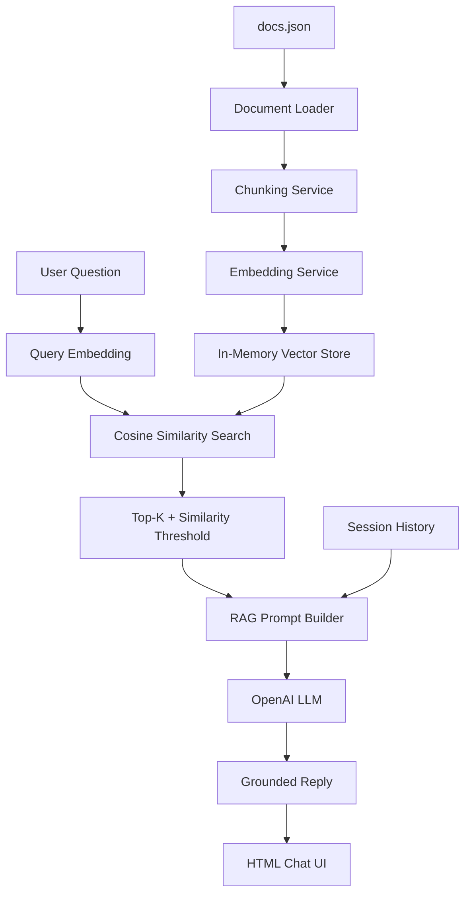

# TRUEAILAB GenAI Assistant with RAG

Production-style GenAI chat assistant built with FastAPI, plain HTML/CSS/JavaScript, embeddings, cosine similarity search, retrieved-context prompting, and short session memory.

## Features

- Loads a custom `docs.json` knowledge base
- Chunks documents and stores metadata for every chunk
- Generates embeddings for each chunk
- Performs vector similarity search with cosine similarity
- Retrieves Top-K chunks before invoking the LLM
- Applies a similarity threshold to prevent unsupported answers
- Builds a grounded RAG prompt with context, conversation history, and the current question
- Maintains the last 3-5 message pairs per `sessionId`
- Includes `/api/chat` and `/health` endpoints
- Ships with a basic browser chat interface using `localStorage`
- Handles validation errors, invalid keys, provider failures, timeouts, and rate limits

## Architecture Diagram



## RAG Workflow

During startup, the backend loads `docs.json`, chunks every document, generates an embedding for each chunk, and stores the chunk vector plus metadata in an in-memory vector store.

During chat, `/api/chat` embeds the user question, compares it against stored vectors, retrieves the top 3 chunks, filters results using the similarity threshold, and only then builds the LLM prompt. If no retrieved chunk passes the threshold, the API returns a safe fallback response.

## Embedding Strategy

The app is configured for OpenAI embeddings through `text-embedding-3-small`. Set `USE_OPENAI=true` and `EMBEDDING_API_KEY` in `.env` to use the real embeddings API.

For local development without keys, or when you hit API limits, set `EMBEDDING_PROVIDER=local`. The app then uses a pure-Python TF-IDF style vectorizer so the API and UI can still be tested. Submission/demo mode should use real API keys.

## Similarity Search Logic

The vector store normalizes document and query vectors, then calculates cosine similarity as a dot product:

```python
score = sum(a * b for a, b in zip(normalized_query, normalized_document))
```

Results are sorted by score descending. The default `TOP_K` is `3`, and the default `SIMILARITY_THRESHOLD` is `0.25` for API embeddings. For the simple local TF-IDF demo mode, `0.12` is a better threshold.

## Prompt Design Reasoning

The prompt explicitly includes:

- Retrieved context
- Short conversation history
- Current user question

It instructs the model to use only the provided context and to admit when the knowledge base lacks enough information. Temperature is fixed at `0.2` for stable, factual answers.

## API Endpoints

### Health

```http
GET /health
```

Response:

```json
{
  "status": "healthy"
}
```

### Chat

```http
POST /api/chat
Content-Type: application/json

{
  "sessionId": "abc123",
  "message": "How can I reset my password?"
}
```

Response:

```json
{
  "reply": "Users can reset their password from Settings > Security > Reset Password...",
  "tokensUsed": 120,
  "retrievedChunks": 3,
  "sources": []
}
```

## Setup Instructions

1. Create and activate a virtual environment.

```bash
python -m venv .venv
.venv\Scripts\activate
```

2. Install dependencies.

```bash
pip install -r requirements.txt
```

3. Create `.env`.

```bash
copy .env.example .env
```

4. Add your API keys to `.env`.

```env
LLM_API_KEY=your_openai_api_key
EMBEDDING_API_KEY=your_openai_api_key
```

5. Run the app.

```bash
python -m uvicorn app.main:app --reload
```

6. Open the chat UI.

```text
http://127.0.0.1:8000
```

## Test Questions

Valid knowledge-base question:

```text
How do I reset my password?
```

Expected result: the assistant retrieves the password reset document and answers with the Settings > Security path.

Unknown question:

```text
What is your refund policy?
```

Expected result: the assistant returns the safe fallback response when similarity is below threshold.

## Deployment Notes

This project can be deployed to Render, Railway, Azure, AWS, or Google Cloud as a FastAPI app.

Example Render start command:

```bash
python -m uvicorn app.main:app --host 0.0.0.0 --port $PORT
```

Required environment variables:

```env
LLM_API_KEY=your_openai_api_key
EMBEDDING_API_KEY=your_openai_api_key
OPENAI_MODEL=gpt-4o-mini
OPENAI_EMBEDDING_MODEL=text-embedding-3-small
```

## Screenshots

Add screenshots after running the local app:

- Chat interface 


- Successful grounded answer
  


